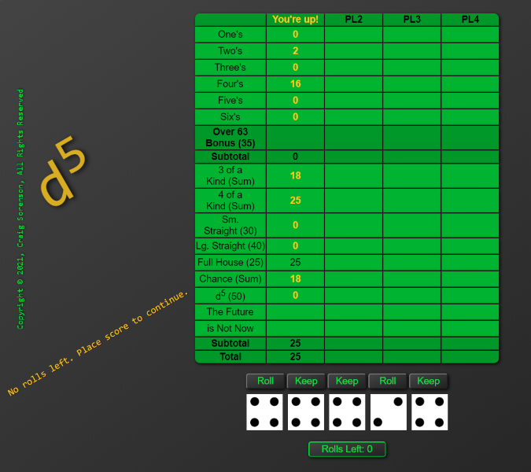

<!-- Project title -->
# d5
<!-- Description -->
## Description
a Yahtzee! clone for one to four players.
<!-- Problem app solves -->
## Problems solved
d5 provides relief from the daily humdrum.
<!-- What does app do? -->
## What does d5 do?
d5 allows one to four players to play this clone of the classic dice game, Yahtzee! 
The goal is to attain the highest number of points possible in 13 rounds of play. 
Scoring is displayed on the board. 
A d5 is scored when all five die are equal and is worth 50 points.
<!-- ToC (optional) -->
<!-- Tech/Languages used -->
## Languages/Technology Used
d5 is coded in Javascript/JQuery and displayed using HTML5 and CSS3
<!-- Contributions -->
## Author / Contributors
Craig Sorenson
<!-- Screenshots -->
## Screenshots
 
<!-- Code snippets -->
<!-- How to install -->
## Installation
1) Download d5.zip
2) Extract to desired location
3) Open the index.html file inside the d5 folder and enjoy!

## Other
This was written in an initial effort to learn JavaScript on my own. The code is a mess (it was worse and has been cleaned up a good bit.) It uses several bad techiques including heavy use of global variables. This will be rewritten from scratch at some point using classes and proper state management. It has been placed here in its current state to demonstrate my progress.
It is not mobile friendly...RWD was not used.
...a first project with an inexperienced instructor(myself!)
<!-- License/Badge -->
## License
BSD
